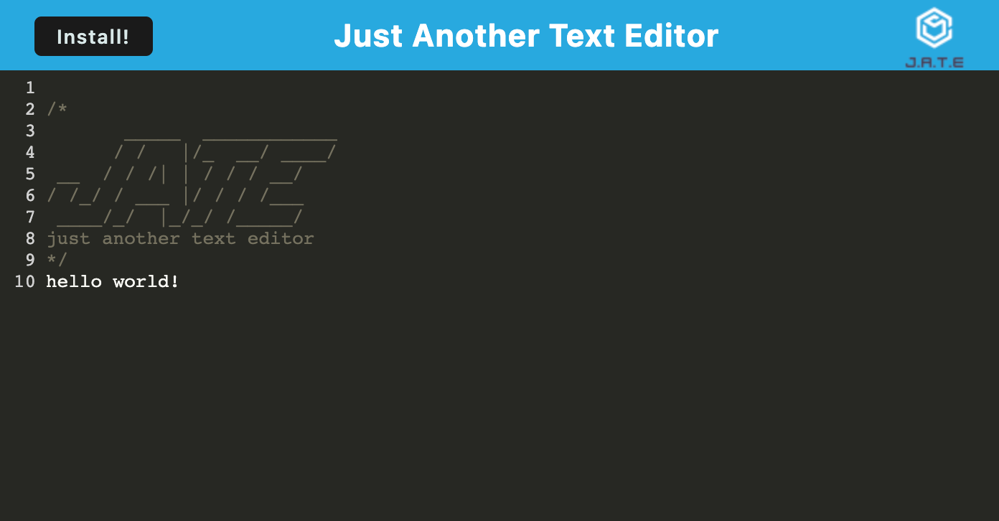

# pwa-challenge

## Table of Contents
* [Description](#description)
* [Installation](#installation)
* [Usage](#usage)
* [Contributing](#contributing)
* [Tests](#tests)
* [License](#license)
* [Questions](#questions)
## Description:
This project is intended to create a basic text editor application that can also be installed as a PWA. This project was made as part of the requirements for a web development bootcamp.

## Installation:
After opening the app (described in usage below), press the install button and confirm in the popup

## Usage:
Navigate to the application using the following link: [Application Link](https://pwa-challenge-dmk252.herokuapp.com/)

* The text displayed can be modified and saved by clicking off of the text box
* When the page is reloaded, your updated text will be displayed

## Contributing:
In order to contribute, please feel free to fork the repo and submit a pull request with your suggested improvement.

## Tests:
N/A

## License:
[MIT License](https://opensource.org/license/mit/)

      Permission is hereby granted, free of charge, to any person obtaining a copy of this software and associated documentation files (the “Software”), to deal in the Software without restriction, including without limitation the rights to use, copy, modify, merge, publish, distribute, sublicense, and/or sell copies of the Software, and to permit persons to whom the Software is furnished to do so, subject to the following conditions:
      
      The above copyright notice and this permission notice shall be included in all copies or substantial portions of the Software.
      
      THE SOFTWARE IS PROVIDED “AS IS”, WITHOUT WARRANTY OF ANY KIND, EXPRESS OR IMPLIED, INCLUDING BUT NOT LIMITED TO THE WARRANTIES OF MERCHANTABILITY, FITNESS FOR A PARTICULAR PURPOSE AND NONINFRINGEMENT. IN NO EVENT SHALL THE AUTHORS OR COPYRIGHT HOLDERS BE LIABLE FOR ANY CLAIM, DAMAGES OR OTHER LIABILITY, WHETHER IN AN ACTION OF CONTRACT, TORT OR OTHERWISE, ARISING FROM, OUT OF OR IN CONNECTION WITH THE SOFTWARE OR THE USE OR OTHER DEALINGS IN THE SOFTWARE.
      
      
## Questions:
Please reach out at either of the following locations if you have any additional questions:
* GitHub: [keimdm](https://github.com/keimdm)
* Email: dmk252@cornell.edu
